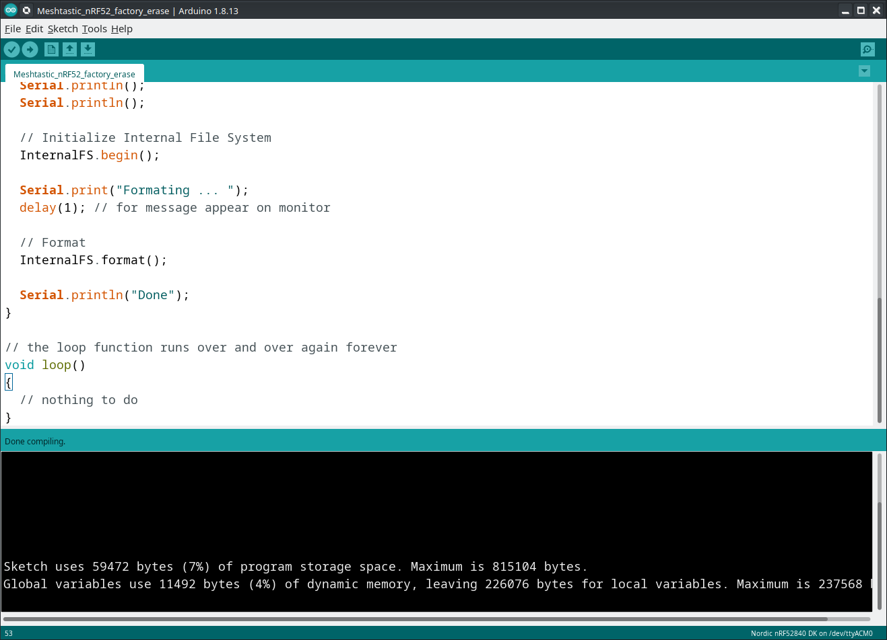
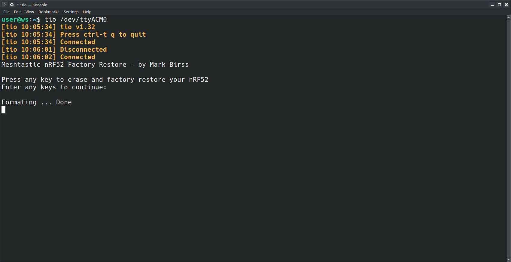

### Adafruit Internal File System Format of nRF52 based devices

Download the pre-compiled generated uf2 

Meshtastic_nRF52_factory_erase.uf2

MD5SUM

6f634aed38d276039b89ac6214de7108

or


### Compile with Arduino selecting a Adafruit nRF52 Board eg Nordic nRF82540 DK



### Find the created hex file in your temp folder e.g (under Linux)

```
find /tmp -name Meshtastic_nRF52_factory_erase.ino.hex
```

### Convert the hex file to uf2
______________________________________
```
./uf2conv.py Meshtastic_nRF52_factory_erase.ino.hex -c -f 0xADA52840; cp flash.uf2 Meshtastic_nRF52_factory_erase.uf2
```

### Usage

### Open a terminal and connect tio to your nRF52 device
```
tio /dev/ttyACM0
```


### Download the uf2 file and copy it to your nRF52 device

double press the reset button to connect to the the uf2 volume

your nRF52 device will automatically reboot and show the screen below



Press any key to continue to format your nRF52 device


